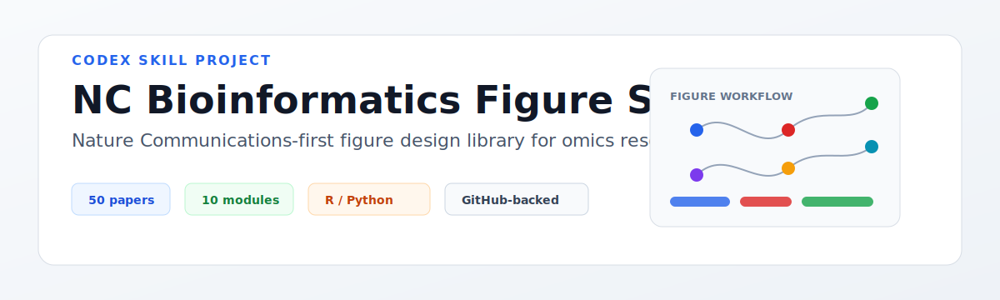

<p align="center">
  
</p>

<h1 align="center">NC Bioinformatics Figure Skills</h1>

<p align="center">
  <strong>A Codex skill for learning bioinformatics figure design from reproducible omics papers.</strong>
</p>

<p align="center">
  <a href="LICENSE"></a>
  
  
  
</p>

---

## 这个项目解决什么问题

我在看单细胞、空间组学和多组学论文时，经常遇到一个问题：论文图很好，但真正想复刻它的表达方式时，很难快速判断应该看哪篇、看哪个仓库、看哪个脚本，以及这种图能不能迁移到自己的项目里。

这个仓库就是为这个问题整理的。它把 Nature Communications 为主的一批生信/组学论文按图形类型拆开，记录论文入口、代码入口、适合学习的 panel、可能用到的 R/Python 包，以及可以沉淀成个人模板的地方。

它更偏“绘图思路和复刻路线”，不是自动绘图工具，也不替代原论文代码。

## 里面有什么

|内容|用途|
|---|---|
|50 篇论文索引|优先收录有 GitHub、Zenodo、notebook、source data 或 reproduce 入口的文章|
|10 类图形模块|把常见的 omics figure 拆成 UMAP、空间图、热图、通讯网络、trajectory、benchmark 等模块|
|Codex skill|把拆论文、设计主图和生成代码骨架这几件事写成固定流程|
|复刻建议|记录应该先看哪些仓库、哪些图型适合作为最小练习|
|模板思路|把一次性读论文变成可复用的个人绘图模板|

## 适合的使用方式

这个项目适合在下面几种场景中使用：

- 准备单细胞、空间组学、多组学或生信方法论文的主图
- 想学习 Nature Communications / Nature 系列论文的 figure 组织方式
- 有自己的分析结果，但不知道如何把 UMAP、marker、通路、通讯或 benchmark 组织成一张图
- 想从公开论文仓库里找到可复刻的绘图代码和输入数据格式
- 想整理一套自己长期复用的 R / Python 绘图模板

## 项目结构

```text
.
├── .codex-plugin/
│   └── plugin.json
├── skills/
│   └── nc-bioinformatics-figure-skills/
│       ├── SKILL.md
│       ├── README.md
│       └── references/
│           └── nc_bioinformatics_visualization_skill_library.md
├── assets/
│   └── project-banner.svg
├── CONTRIBUTING.md
├── LICENSE
└── README.md
```

最重要的文件是：

- [`SKILL.md`](skills/nc-bioinformatics-figure-skills/SKILL.md)：Codex 调用这个 skill 时遵循的规则。
- [`nc_bioinformatics_visualization_skill_library.md`](skills/nc-bioinformatics-figure-skills/references/nc_bioinformatics_visualization_skill_library.md)：论文和图形模块索引。

## 图形模块

|模块|主要看什么|适合沉淀的模板|
|---|---|---|
|Embedding narrative|UMAP / embedding 如何和细胞类型、疾病状态、模型指标一起讲故事|多列 embedding + 定量指标|
|Spatial domain story|空间坐标、组织背景、domain、marker 和局部 zoom 如何放在同一张图里|H&E + spatial map + marker + zoom|
|Marker heatmap|marker dotplot / heatmap 如何排序、分组和加注释|cell type x marker heatmap|
|Communication story|通讯结果什么时候画热图，什么时候画网络|LR heatmap + top interaction network|
|Trajectory story|trajectory 如何同时表达方向、时间和基因动态|velocity / pseudotime / gene trend 三联图|
|Benchmark story|方法比较怎样避免只堆指标|metric matrix + rank + case study|
|Multi-omics integration|RNA、ATAC、protein、spatial 等结果如何对齐|multi-modal grid|
|Genome track story|基因结构、信号轨道和变异效应如何共用坐标轴|genome track panel|
|Microbiome network|composition、co-occurrence 和 phenotype association 如何分层|composition + network + association heatmap|
|Journal-level layout|一张主图如何只回答一个核心问题|workflow -> main map -> quantification -> model|

## 快速开始

先看论文索引：

[`skills/nc-bioinformatics-figure-skills/references/nc_bioinformatics_visualization_skill_library.md`](skills/nc-bioinformatics-figure-skills/references/nc_bioinformatics_visualization_skill_library.md)

如果在 Codex 中使用，可以直接这样问：

```text
请使用 nc-bioinformatics-figure-skills，帮我把这个单细胞结果设计成 NC 风格主图。核心结论是...
```

```text
请使用 nc-bioinformatics-figure-skills，给我一个空间组学绘图 skill 的 2 周训练计划，优先 GitHub 有 figure code 的 NC 论文。
```

```text
请使用 nc-bioinformatics-figure-skills，拆解这篇 Nature Communications 论文的 figure 版式和可复刻代码路径：...
```

## 推荐工作流


实际使用时不需要一次做完。通常先选一个 A 级条目，找到 figure notebook 或 source data，复刻一个最小 panel，比泛泛地读十篇综述更有用。

## 证据等级

|等级|含义|建议|
|---|---|---|
|A|已经看到 figure、notebook、reproduce、source data 或明确代码入口|优先复刻|
|B|论文指向 GitHub，但具体 figure 脚本还需要继续找|适合扩展阅读|

## Roadmap

- [x] 整理 50 篇 NC / Nature 系列生信 figure 索引
- [x] 拆分 10 个常用绘图模块
- [x] 提供 Codex skill 和插件 manifest
- [ ] 增加 toy data 示例
- [ ] 增加 R / Python 模板目录
- [ ] 为每个模块补一个 30 分钟练习任务
- [ ] 增加 figure code 路径审计表

## 贡献

欢迎补充新的论文、仓库和复刻记录。最好同时给出论文链接、代码链接、值得看的 figure、使用的绘图包，以及你判断它属于 A 级还是 B 级的理由。

更具体的格式见 [CONTRIBUTING.md](CONTRIBUTING.md)。

## 许可证与边界

本项目采用 [MIT License](LICENSE)。

仓库只保存论文和代码入口、图形拆解笔记和个人学习模板，不重新分发第三方论文全文、图片或代码。复刻具体图形时，请以原论文、数据和代码仓库的许可证为准。
