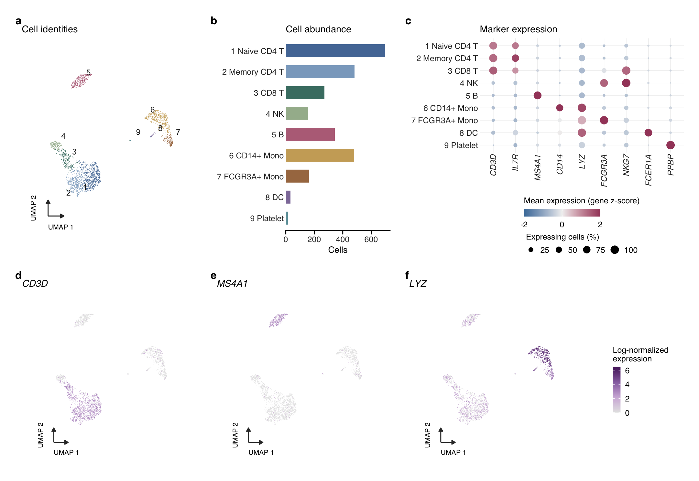

<p align="center">
  
</p>

<h1 align="center">NC Bioinformatics Figure Skills</h1>

<p align="center">
  <strong>A single-cell figure workflow for Codex, backed by tested R tools.</strong>
</p>

<p align="center">
  <a href="LICENSE"></a>
  
  
</p>

## What this project is for

Give the Codex skill existing single-cell tables and a figure task. The skill calls a fixed R entry point, reads the checks, inspects the outputs, and requests corrections when needed. `ncfigR` handles shared plotting and export; `scfigR` prepares atlas panels and records each task attempt. The first workflow produces descriptive atlas figures; statistical analysis engines are a later step.

Skill 2.2 keeps this single-cell execution workflow as the default. Figure planning,
paper/code learning and other plotting domains are preserved as on-demand modules,
not loaded for an ordinary atlas task. See the [skill entry point](skills/nc-bioinformatics-figure-skills/SKILL.md).

## Install

Requires R 4.1 or later. From the repository root:

```sh
git clone https://github.com/jiangcongxin/nc-bioinformatics-figure-skills.git
cd nc-bioinformatics-figure-skills
```

```r
install.packages("remotes")
remotes::install_local("packages/ncfigR", dependencies = NA, upgrade = "never")
remotes::install_local("packages/scfigR", dependencies = NA, upgrade = "never")
```

For a project-local stable runtime, then run:

```sh
Rscript scripts/install_runtime.R
Rscript scripts/check_runtime.R
```

The installer places exactly `ncfigR 0.2.1` and `scfigR 0.3.1` in `.r-library/`.
It does not download or upgrade dependencies. The task/review entry points prefer
that library and reject versions differing from `runtime-lock.tsv`. The health
check records R and dependency versions; third-party dependencies are not fully
locked. Direct R API calls do not use the CLI version gate.

## Run a task

```sh
Rscript scripts/run_sc_job.R --job examples/single-cell/task-demo.json
```

This synthetic example returns a JSON response and exits **2** (`needs_review`) after technical checks. It deliberately does not approve its own figures. See the [task workflow](examples/single-cell/JOB_WORKFLOW.md) for real inputs, reports, visual review and corrections. The [skill protocol](skills/nc-bioinformatics-figure-skills/references/single_cell_execution.md) defines the agent's steps; an agent host must load the updated skill and have the R runtime installed.

## Plot directly in R

```r
library(ncfigR)
library(scfigR)

data <- load_sc_example()
figure <- do.call(compose_sc_atlas_figure, data)
figure
export_figure_bundle(figure, "atlas", out_dir = "figures", width = 9, height = 7)
```

The bundled example is synthetic. Exports include PDF, SVG, 300-dpi PNG, and the R session information. A source manifest can be supplied as a data frame.

For your own data, use `prepare_sc_atlas_data()` with a cell metadata/embedding table and a long expression table. See the [single-cell guide](examples/single-cell/README.md) for exact columns, zero-expression handling, and the real PBMC3k example.

## Real-data example



2,638 cells and nine annotated cell types from Satija Lab's `pbmc3k.final` dataset. The figure uses existing UMAP coordinates and annotations; marker summaries are calculated from the RNA data layer. [Source and reproduction instructions](examples/single-cell/README.md#pbmc3k-real-data-example). Dataset and derived preview: CC BY 4.0, attributed to Satija Lab and 10x Genomics.

## Other tools

`spfigR`, `commfigR`, `trajfigR`, `benchfigR`, and `multiomfigR` are early-stage companion packages. This development round focuses on `ncfigR` and `scfigR`.

The [Codex skill](skills/nc-bioinformatics-figure-skills/SKILL.md) includes figure-planning notes, source-data templates, and plotting recipes.

## Development

Install `rcmdcheck`, `testthat`, `knitr`, and `rmarkdown`, and make sure Pandoc is available (it is included with RStudio).

```sh
Rscript scripts/check_packages.R
```

Checks build the two packages, execute tests, and render the vignettes. GitHub Actions is configured for Linux, macOS, and Windows. Changes are listed in [CHANGELOG.md](CHANGELOG.md).

## License

Code: MIT License. The PBMC3k dataset and derived preview are attributed to Satija Lab and 10x Genomics under CC BY 4.0.

Paper titles, article links, and GitHub/code links are used as learning indexes. Follow the license of each original paper, dataset, and code repository when reproducing specific figures.
