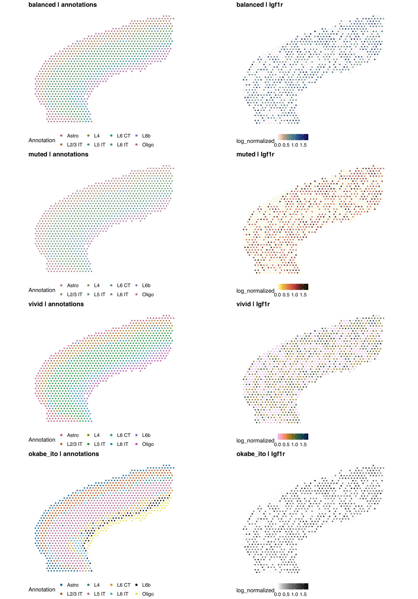
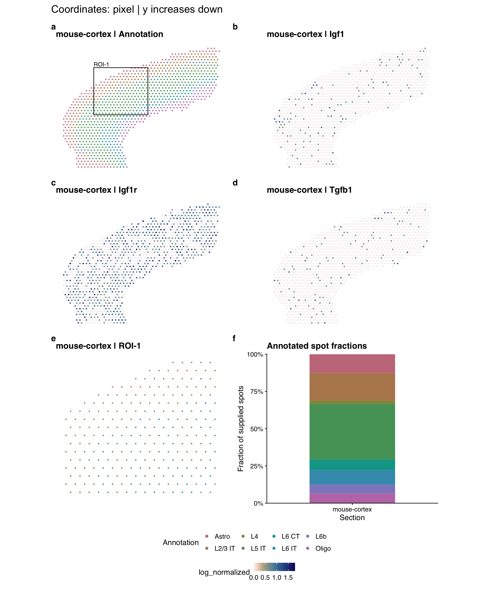

# Spatial overview

`spfigR 0.2.1` draws existing spatial coordinates, annotations and feature values.
Each section keeps its own coordinate frame. The workflow exports artwork,
source tables, methods and checks, then waits for visual review.

## Inputs

CSV and TSV are accepted. Keys are read as text, including leading zeros.

| Table | Required columns |
|---|---|
| Coordinates | `section_id,spot_id,x,y,domain` |
| Features | `section_id,spot_id,feature,value` |
| Optional regions | `section_id,region_id,xmin,xmax,ymin,ymax` |
| Optional palette | `domain,color` |

Every selected feature must have one finite value for every supplied spot.
Include explicit zeros: missing rows are errors, not assumed zero expression.
Spot IDs may repeat across sections, but not within a section. Duplicate spatial
locations within a section are rejected. A region selects spot centers inside
inclusive bounds; overlapping regions do not change the section composition.

Declare `expression_scale` (`counts`, `log_normalized`, `signed_score`),
`coordinate_unit` (`pixel`, `micrometer`, `arbitrary`) and `y_axis` (`up`, `down`).
The runner does not guess orientation, normalize features, swap axes or register
images. Features share one color range across sections and genes; use one common
upstream scale. Composition means **annotated spot fractions**, not cell fractions
or area coverage. Point sizes are display sizes, not physical spot diameters.

Current bounds: 200,000 spots, four sections, three features, 30 annotations and
four regions. Dense figures may still need a larger canvas or fewer panels.

## Choose colors

The plotting base uses cowplot themes, colorspace categorical palettes and
scico continuous palettes through their public APIs. Install missing dependencies
explicitly before installing the local runtime:

```r
install.packages(c("cowplot", "colorspace", "scico"))
spfigR::sp_color_styles()
```

Set `figure.color_style` to `balanced` (default), `muted`, `vivid` or `okabe_ito`.
Each pairs annotation colors with sequential expression and diverging score
colors. Optionally set `figure.feature_palette`, e.g. `"lapaz"` for expression
or `"vik"` for signed scores. Mismatched scale semantics are rejected. Explicit
annotation palettes override only the categorical colors. Okabe-Ito supports
at most nine categories; colors are never recycled.

```sh
Rscript examples/spatial/compare_color_styles.R
```

After preparing the real example below, this renders all four styles from the
same inputs, including a category-color/CVD simulation sheet. Each full task
still needs actual visual review. [Component sources and rules](../../skills/nc-bioinformatics-figure-skills/references/plotting_base.md).



[Category-color and color-vision simulation sheet](../../assets/spatial-color-vision-preview.png).
The simulation sheet exposes similar-looking category pairs; style names do
not certify accessibility. For important groups, keep direct labels and inspect
the selected colors at the intended output size.

Scientific Colour Maps: Fabio Crameri, [CC BY 4.0](https://creativecommons.org/licenses/by/4.0/),
[source](https://doi.org/10.5281/zenodo.1243909); sampled through scico and
reversed for nonnegative expression. Category and continuous colors, attribution
and simulation values are frozen in each run's source-data directory. Simulation
does not guarantee that every category pair is distinguishable.

## Run

Install the locked runtime from the repository root (see the main README), then:

```sh
Rscript scripts/run_sp_job.R --job examples/spatial/task-example.json
```

The bundled example is synthetic. Successful rendering exits **2** with
`needs_review`, not approval. Read the returned report and methods; inspect the
PNG and PDF or SVG at the declared size. Use the exact paths returned by the
runner, not a previous run's files.

```sh
Rscript scripts/review_sp_job.R --run <run-directory> --review <review.json>
Rscript scripts/run_sp_job.R --job <run-directory>/resolved_job.json
```

The review schema and six evidence-backed checks follow the
[spatial execution protocol](../../skills/nc-bioinformatics-figure-skills/references/spatial_execution.md).
Exit codes: **0** reviewed pass, **2** review needed or revision, **1** failure.
Corrections create a new run. Frozen files are checksum-checked and terminal
reviews cannot be replaced. Approval is a recorded inspection, not biological
validation or journal certification. Direct R calls bypass the CLI version gate.

## Mouse-cortex Visium example

The optional adapter needs an installed CellChat package to read the existing
object. Ordinary source-table tasks do not need CellChat.

```sh
Rscript examples/spatial/prepare_mouse_cortex.R
Rscript scripts/run_sp_job.R --job examples/spatial/task-mouse-cortex.json
```

1,073 spots and eight existing annotations from Suoqin Jin (2023),
[CellChat object of mouse brain 10X Visium dataset](https://doi.org/10.6084/m9.figshare.24516436.v1),
CC BY 4.0. Fixed file 43061620, MD5 `4caf7f60423f75ab7870fb7a30c6c412`.
The adapter exports existing SCT-normalized `Igf1`, `Igf1r` and `Tgfb1` values;
it does not rerun inference. It verifies metadata barcode alignment and labels.

The image display mapping is `x = stored y_cent`, `y = stored x_cent`, with y
increasing down, following the upstream CellChat spatial plotting convention.
Coordinates are image pixels, with no histology overlay or physical-distance
conversion. ROI-1 is a demonstration rectangle, not an anatomical niche.



Dataset and derived preview: CC BY 4.0, attributed to Suoqin Jin. Cached data and
job outputs are ignored by Git. Frozen source tables remain in each local run.
